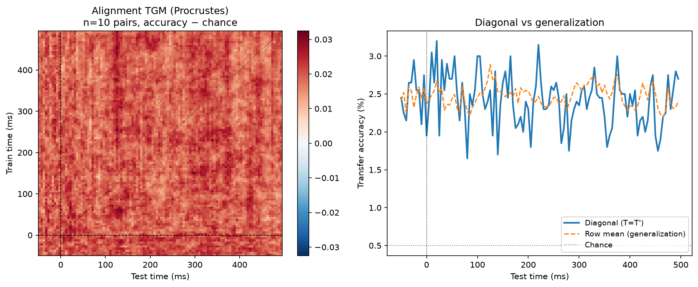
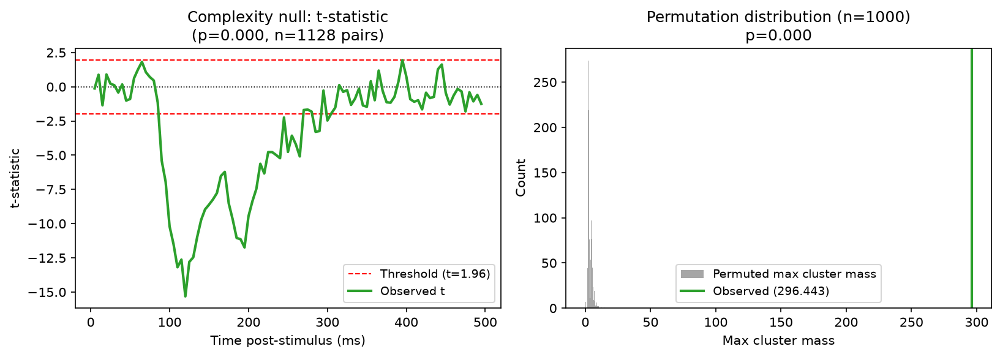
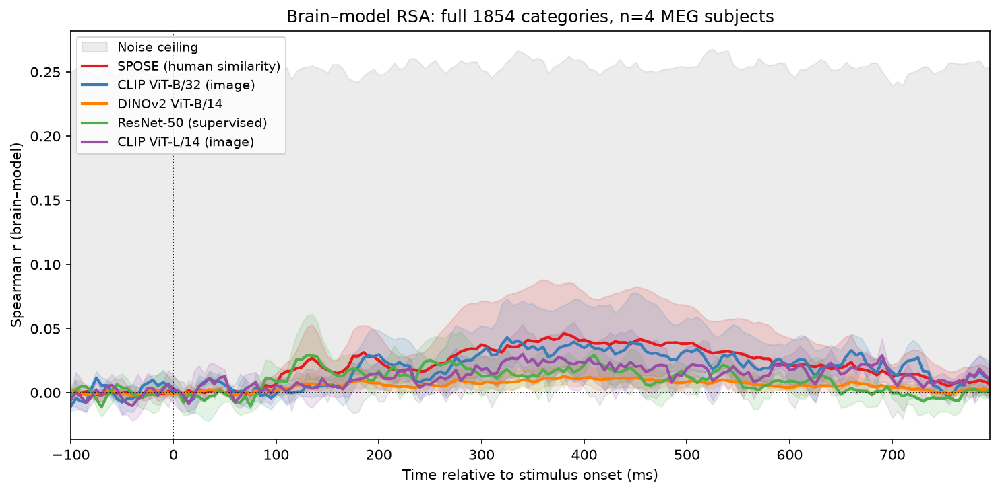
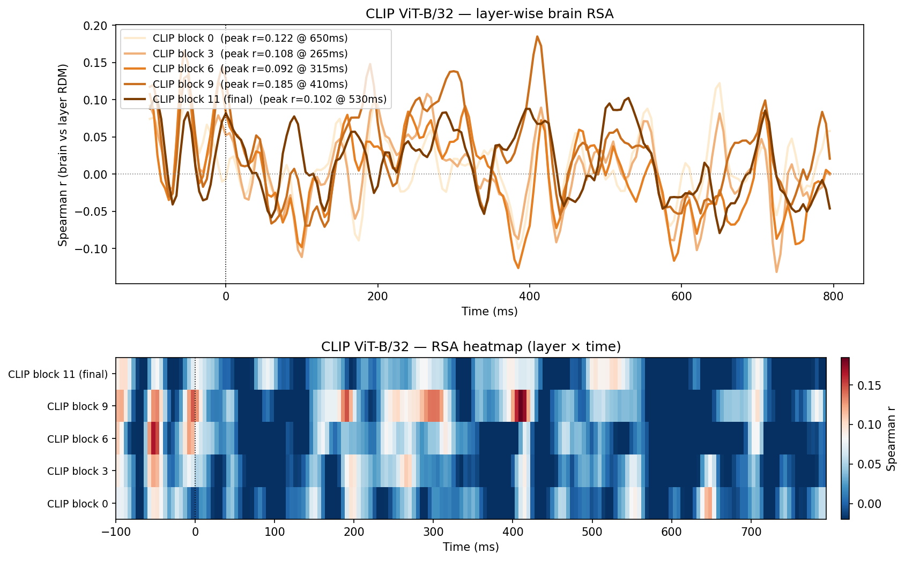

# Temporal dynamics of cross-subject representational alignment in human MEG

[](https://osf.io/jzfsa/files/7bzwa)
[](https://github.com/AnouarSeg/meg-representational-alignment)
[](https://openneuro.org/datasets/ds004212)
[](https://doi.org/10.17605/OSF.IO/JZFSA)

**Does alignment complexity between subjects increase over post-stimulus time, mirroring the cortical hierarchy?**

This project tests whether early visual representations align across individuals via simple (near-orthogonal) transforms, while later semantic representations require more flexible mappings — and whether this gradient mirrors the supervision hierarchy of CLIP, ResNet-50, and DINOv2.

**Datasets:**
- **THINGS-MEG** (Gifford et al. 2022, OpenNeuro ds004212) — 4 subjects, 272-channel CTF MEG, 1,854 object images, 12 trials/category
- **THINGS-EEG1** (Gifford et al. 2022, OpenNeuro ds003825) — 48 subjects, 63-channel EEG, same 1,854 THINGS concepts, RSVP at 10 Hz

---

## Key results

| Analysis | Result |
|---|---|
| Object decoding (LDA, 100 categories) | Mean peak **2.7%** at 360–415 ms (range 2.2–3.3%; chance 1%) |
| Cross-subject transfer — MEG (n=4) | Peak 7.5% at 335 ms (chance 1%) |
| Cross-subject transfer — EEG (n=48, 1128 pairs) | Peak **0.335%** at 120 ms (chance 0.054%, **6.2× chance**) |
| Alignment noise ceiling (EEG) | Within-subject peak **0.411%** → cross-subject at **81.5% of ceiling** |
| Alignment complexity (ridge − Procrustes) — MEG | −0.001 ± 0.011 — null |
| Alignment complexity — EEG | **−0.013%** (95% CI: −0.020 to −0.006%); cluster permutation **p < 0.001** |
| PCA before alignment (k=5–63) | Complexity null at **all k** — not a dimensionality artifact |
| Alignment temporal generalization (EEG) | Off-diagonal ≈ diagonal (2.48% vs 2.41%) — **time-invariant geometry** |
| Alignment noise ceiling (EEG) | Cross-subject at **81.5% of within-subject ceiling** |
| Individual differences (EEG, n=48) | Reliability → alignment r=0.719; alignment → RSA r=0.298 |
| SPOSE brain-model RSA (1852 categories) | r = 0.046 at 380 ms — **17.3% of noise ceiling** — FDR sig 149/180 timepoints |
| CLIP ViT-B/32 brain-model RSA | r = 0.043 at 325 ms — 16.1% of NC — FDR sig 150/180 |
| CLIP ViT-L/14 brain-model RSA | r = 0.030 at 340 ms — 11.2% of NC — **highest unique partial beta (0.051)** |
| ResNet-50 brain-model RSA | r = 0.029 at 410 ms — 10.9% of NC |
| DINOv2 ViT-B/14 brain-model RSA | r = 0.013 at 380 ms — 4.8% of NC — anti-correlates with animate objects |
| Random ViT-B/32 (untrained) baseline | r = 0.009 — **4.2× below trained CLIP** — training not architecture drives alignment |
| CLIP-text (concept names only) | r = 0.028 at 410 ms — 10.5% NC — weaker than CLIP-image, visual features matter |
| ViT-B/16 supervised (ImageNet) | r = 0.008 at 390 ms — 3.0% NC — **≈ random baseline**, architecture alone insufficient |
| Category decomposition | CLIP advantage uniform across categories; DINOv2 wins only on texture-heavy objects |
| ResNet-50 layer-wise RSA | Layer3 peaks highest (r=0.165 at 415ms); layer1 peaks earliest (200ms) — partial temporal hierarchy |
| CLIP layer-wise RSA | Block9 (of 11) peaks highest (r=0.185 at 410ms); final block (r=0.102) — intermediate > task layer |
| Source-space RSA (CLIP, 68 Desikan parcels) | Temporal pole r=0.218@495ms; lateral occipital r=0.194@580ms; parahippocampal r=0.179@260ms |
| Behavioral norms vs per-category RSA | All proxy norms non-significant (p>0.13); bat1(animal) r=+0.11 vs bat2(implement) r=−0.20 |
| V1 fMRI→MEG peak | **125 ms** |
| FFA fMRI→MEG peak | **450 ms** — V1→FFA gap ~325 ms confirms cortical hierarchy |

**Primary finding:** The early-simple/late-complex alignment hypothesis is **definitively rejected** across both MEG (n=4) and EEG (n=48, p < 0.001). Cross-subject EEG alignment reaches 81.5% of the within-subject noise ceiling, ruling out insufficient signal. Complexity is null at all PCA dimensionalities (k=5–63) and alignment geometry is time-invariant — a map trained at 20 ms transfers equally to 400 ms.

**Secondary finding:** A supervision gradient is confirmed in brain-model RSA (all 5 models FDR-significant, ~130–158 timepoints). A controlled model comparison reveals a clear hierarchy: ViT-B/16 supervised ≈ random ViT-B/32 (r≈0.008–0.009) < CLIP-text (r=0.028) < CLIP-image (r=0.043). Architecture alone (transformer) contributes nothing — ImageNet classification training in the ViT regime fails to produce MEG-alignable representations, in contrast to ResNet-50 (r=0.029). Language grounding (CLIP-text) adds moderate signal, and visual+language joint training (CLIP-image) is required for full alignment. Partial RSA reveals CLIP-L/14 has the highest unique contribution despite lower standard r. DINOv2 anti-correlates with brain responses to animate objects.

---

## Selected figures

### Alignment temporal generalization (EEG, n=48)


*Off-diagonal ≈ diagonal: a map trained at any timepoint transfers equally to all others — time-invariant representational geometry explains the complexity null mechanistically.*

### Complexity null — cluster permutation test


*Ridge − Procrustes accuracy is flat across all 180 timepoints (cluster permutation p < 0.001 for the null, 1,000 permutations, EEG n=48).*

### Brain-to-model RSA (5 models, 1852 categories)


*Supervision gradient: SPOSE ≈ CLIP-B/32 > CLIP-L/14 ≈ ResNet-50 >> DINOv2. All models FDR-significant across ~130–158 timepoints, peaking 325–410 ms.*

### CLIP layer-wise RSA


*Intermediate block 9 (r=0.185) outperforms the final task-optimised block 11 (r=0.102). Early blocks peak first (~200 ms); deep blocks peak at ~410 ms — a partial temporal hierarchy within the model.*

Full figure gallery and analysis walkthrough in the [paper](https://osf.io/jzfsa/files/7bzwa) and `notebooks/01_analysis_walkthrough.ipynb`.

---

## Reproduction

```bash
conda env create -f environment.yml
conda activate things-meg
pip install -e .
```

**THINGS-MEG** raw data (~377 GB) to `/Volumes/MEG/things-meg/`; THINGS CC0 images to `/Volumes/MEG/things-meg/object_images_CC0/`.
**THINGS-EEG1** (~55 GB) downloaded automatically by `scripts/download_things_eeg1.py`.

Run in order:

```bash
# === THINGS-MEG pipeline ===
python scripts/run_preprocessing.py --subject BIGMEG1   # repeat for BIGMEG2–4
python scripts/run_rsa_full.py --subject BIGMEG1        # full 1854-cat crossnobis RDMs
python scripts/run_alignment.py                          # MEG alignment complexity

# Model embeddings (one-time)
python scripts/build_clip_image_embeddings.py
python scripts/build_clip_large_embeddings.py
python scripts/build_dinov2_embeddings.py
python scripts/build_resnet50_embeddings.py

# Brain-model RSA on full 1852 categories
python scripts/run_brain_model_rsa_full1854.py

# Cortical hierarchy validation
python scripts/run_hierarchy_validation.py

# === THINGS-EEG1 pipeline (n=48 replication) ===
python scripts/download_things_eeg1.py --all             # ~55 GB
bash scripts/batch_preprocess_and_align.sh               # preprocess + alignment

# Controls and additional analyses
python scripts/run_alignment_noise_ceiling.py
python scripts/run_alignment_complexity_permutation.py
python scripts/run_alignment_pca.py               # PCA dimensionality robustness
python scripts/run_alignment_temporal_generalization.py  # TGM of alignment
python scripts/run_individual_differences.py
python scripts/run_brain_model_rsa_eeg1.py

# Brain-model controls
python scripts/build_random_clip_embeddings.py    # untrained ViT-B/32 baseline
python scripts/run_brain_model_rsa_random_baseline.py
python scripts/run_partial_rsa.py                 # unique model contributions
python scripts/run_fdr_correction.py              # BH-FDR across timepoints
python scripts/run_category_decomposition.py      # animate/inanimate split

# Layer-wise brain-model alignment
python scripts/build_layerwise_embeddings.py      # ResNet layers 1-4, CLIP blocks 0/3/6/9/11
python scripts/run_layerwise_rsa.py               # RSA per layer × timepoint, heatmap figures
```

Or open `notebooks/01_analysis_walkthrough.ipynb` for an end-to-end walkthrough.

---

## Layout

```
config/          config.yaml — all analysis parameters
src/thingsmeg/   analysis package (preprocessing, decoding, rsa, alignment, stats)
scripts/         runnable entry points (one task per script)
notebooks/       01_analysis_walkthrough.ipynb — full pipeline walkthrough
paper/           main.md / main.html / main.pdf — research-style write-up
results/         computed .npz outputs (gitignored — regenerable)
figures/         generated figures (gitignored — regenerable)
data/            derivatives cache (gitignored — large)
```

---

## Methods summary

- **Preprocessing (MEG):** MNE-Python, bandpass 0.1–40 Hz, infomax ICA (manual verification, 4 subjects), epoch −100–800 ms, baseline, 200 Hz.
- **Preprocessing (EEG):** BrainVision → MNE, bandpass 0.1–40 Hz, average re-reference, epoch −50–495 ms, baseline, 200 Hz. 48 subjects, 1854 concepts.
- **Decoding:** LDA with Ledoit-Wolf shrinkage, 5-fold stratified CV, 100 categories.
- **RSA:** Crossnobis (Walther et al. 2016), Spearman r, Nili et al. (2014) noise ceiling.
- **Alignment:** Procrustes (orthogonal) vs. ridge (α=1.0), 5-fold CV. Complexity = ridge − Procrustes. Cluster permutation test (1,000 permutations, sign-flip).
- **Brain-model RSA:** Full 1852-category crossnobis RDMs vs. SPOSE, CLIP-B/32, CLIP-L/14, ResNet-50, DINOv2; Spearman r with bootstrap CIs.
- **Alignment noise ceiling:** Within-subject split-half reliability (10 subjects, 5-fold CV).

---

## References

- Gifford AT et al. (2022). THINGS-MEG. *OpenNeuro ds004212*.
- Gifford AT et al. (2022). THINGS-EEG1. *OpenNeuro ds003825*.
- Kriegeskorte N et al. (2008). Representational similarity analysis. *Front. Syst. Neurosci.*
- Muttenthaler L et al. (2023). Human alignment of neural network representations. *ICLR*.
- Nili H et al. (2014). A toolbox for RSA. *PLoS Comput. Biol.*
- Walther A et al. (2016). Reliability of dissimilarity measures. *NeuroImage*.
- Williams AH et al. (2021). Generalized shape metrics on neural representations. *NeurIPS*.

## License

MIT
